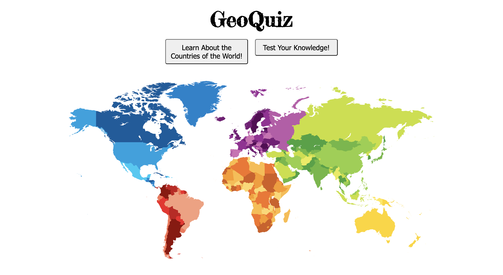

# GeoQuiz
## Educational Web App and Game
Geoquiz is an educational web app and game. It comprises of two different modes:
* Learn mode
* Play mode

In `Learn mode` you can discover faacts and details about each of th world's countries by clicking on them within the interactive map.

In `Play mode` you will be prompted with a countries flag and have to use the map to guess the correct country. The app allows users to save their results as they progress using their username.

## MVP
A user should be able to:
* Interact with a visual map of countries
* Click on a country to display facts/details
* Play a game to guess a country from its flag
The app should:
* Use an API for country data
* Import a library to render an interactive map

## Example Extensions
* See visual results of correct answers
* Record which countries have been correctly identified by a user
* Show details when correctly selected
* Manage top scores lists

## Setup/Installation
Install dependencies in both the client and server folders:
    $ cd client
    $ npm install

    $ cd ../server
    $ npm install

Run express server (leave running in a terminal window). Within the **server** folder:
    $ npm run server:dev
Run Vue development environment (leave running in a terminal window). Within **client** folder:
    $ npm run serve

## API, Libraries, Resources
* [vue-svg-map](https://www.npmjs.com/package/vue-svg-map)
* [RESTCountries API](https://restcountries.eu/)
* [svg-pan-zoom](https://github.com/ariutta/svg-pan-zoom)
